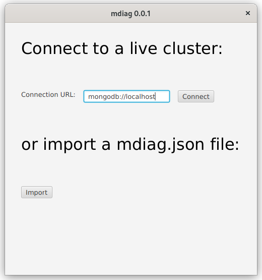
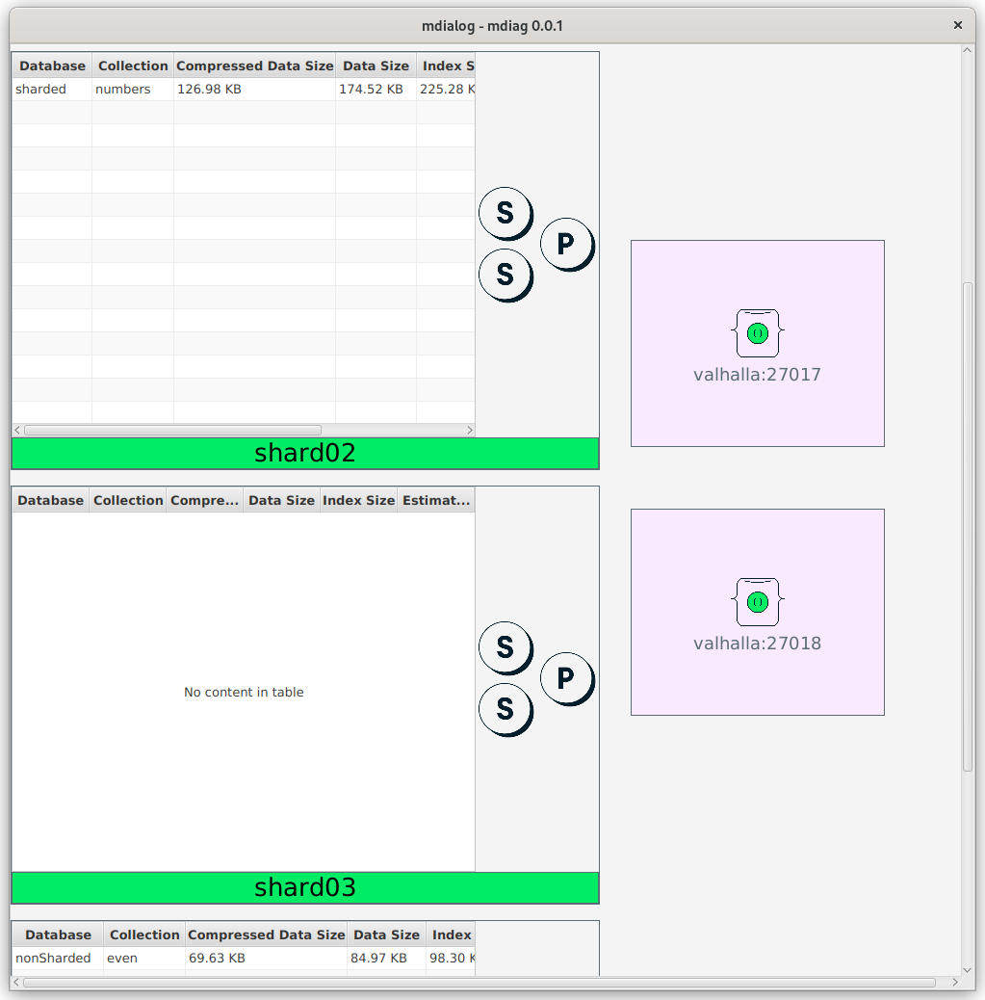

# mdiag    

JavaFX application that summarises the topology of MongoDB clusters. It requires Java 18 to run.  This application is still in development, and it lacks decent quality checks and lots of useful functionalities.

| MongoDB Version | Tested | Should Work |
|-----------------|--------|-------------|
| 6.0             | yes    | yes         |
| 5.0             | yes    | yes         |
| 4.4             | no     | yes         |

## Download

You can download the latest release for your operating system in the [releases page](https://github.com/kmruiz/mdiag/releases). It is recommended to always verify
the signature of the release with the md5 file of your version.

## Features

* [x] Can connect to a MongoDB sharded cluster
* [x] Shows mongos instances in the cluster
* [x] Shows the primary of a shard
* [x] Shows secondaries of shards
* [ ] Shows sample documents of collections
* [ ] Shows arbiters of shards
* [ ] Topology of the configServer
* [ ] Shows analytics nodes of shards
* [ ] Shows unbalanced shards
* [ ] Shows a changelog of the topology
* [x] Shows collection information and their primary shards
* [x] Reports can be exported to JSON and imported again
* [ ] Support for replica sets
* [ ] Support for standalone mongod instances
* [ ] Use GraalVM for native image distributions (_nice to have_)

Other features might be coming also if I need them.

## Images

### Initial Window

Allows you to specify the connection to a live cluster or to import a JSON report.

### Dashboard

Shows an overview of the current cluster.

# Disclaimer

This software is not supported by [MongoDB, Inc.](https://mongodb.com) under any of their commercial support subscriptions or otherwise. 
Any usage of mtools is at your own risk. Bug reports, feature requests and questions can be posted in the Issues section on GitHub.